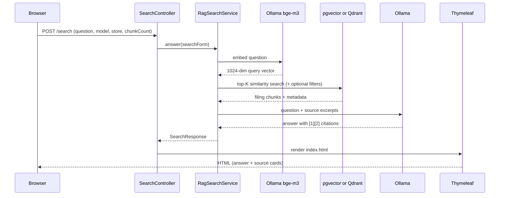

# SEC EDGAR Semantic Search UI

RAG web app for SEC EDGAR filings stored in **pgvector** or **Qdrant**. Ask a natural-language question, retrieve matching chunks from your chosen vector store, and generate a cited answer with a local **Ollama** LLM.

Companion ingest projects: [sec-edgar-filings-to-pgvector](https://github.com/sanjuthomas/sec-edgar-filings-to-pgvector), [sec-edgar-filings-to-qdrant](https://github.com/sanjuthomas/sec-edgar-filings-to-qdrant). Full Docker stack: [sec-edgar-filings-rag-demo](https://github.com/sanjuthomas/sec-edgar-filings-rag-demo).

Licensed under the [MIT License](LICENSE). AI agent guidance: [AGENTS.md](AGENTS.md).

## Features

- **RAG search UI** — Thymeleaf form with question, Ollama model, vector store, chunk count, and optional ticker/form filters
- **Dual vector stores** — pgvector (JDBC) or Qdrant (REST); selectable in the UI
- **Configurable chunk count** — presets 10 / 25 / 50 / 100 or any value from 1–500
- **RAG answers with citations** — Ollama synthesizes an answer from retrieved chunks with inline `[1]`, `[2]`, … citations and source cards linking to SEC EDGAR
- **Search-in-progress UX** — submit button disables and shows "Searching…" until the page reloads
- **Result metadata** — retrieval/generation timing, vector store, model, and source count

## Stack

| Layer | Technology |
|-------|------------|
| UI | Spring Boot 3.4 + Thymeleaf |
| Retrieval | PostgreSQL + pgvector **or** Qdrant REST |
| Query embeddings | Ollama `bge-m3` via Spring AI (1024-dim) |
| Answer generation | Spring AI + Ollama (user-selectable model; default `qwen3:30b`) |

> **Embedding model note:** Indexes were built with `BAAI/bge-m3` (1024 dimensions). Query embeddings must use the same model (`ollama pull bge-m3`). The previous `bge-small-en-v1.5` (384-dim) index is **not** compatible.

## Prerequisites

- Java **21** (CI target; Java 25 may break Mockito tests)
- Maven 3.9+
- PostgreSQL with pgvector on `localhost:5433`, database `edgar` (when using pgvector)
- Qdrant on `localhost:16333` (when using Qdrant)
- Ollama on `localhost:11434` with chat models and **`bge-m3`** for query embeddings

## Quick start

```bash
ollama pull bge-m3
ollama list
mvn spring-boot:run
```

Open http://localhost:8095

Example questions:

> Do you know if the Adobe board approved a buyback program?

> Who are the elected directors in Goldman Sachs?

Optional filters: ticker (`GS`), form (`10-K`).

## Docker

Published to Docker Hub as [`sanjuthomas/sec-edgar-filings-semantic-search-ui`](https://hub.docker.com/r/sanjuthomas/sec-edgar-filings-semantic-search-ui).

### Run from Docker Hub

Requires **pgvector**, **Qdrant** (if selected), and **Ollama** reachable from the container:

```bash
docker run --rm -p 8095:8095 \
  -e SPRING_DATASOURCE_URL=jdbc:postgresql://host.docker.internal:5433/edgar \
  -e SPRING_DATASOURCE_USERNAME=sanjuthomas \
  -e SPRING_AI_OLLAMA_BASE_URL=http://host.docker.internal:11434 \
  -e APP_VECTORSTORES_QDRANT_URL=http://host.docker.internal:16333 \
  --add-host=host.docker.internal:host-gateway \
  sanjuthomas/sec-edgar-filings-semantic-search-ui:latest
```

Or with Compose:

```bash
docker compose up --build
```

### Build locally

```bash
docker build -t sanjuthomas/sec-edgar-filings-semantic-search-ui:local .
```

### Publish to Docker Hub (maintainers)

GitHub Actions publishes on push to `main`, version tags (`v*`), or manual **workflow_dispatch**.

| Secret | Description |
|--------|-------------|
| `DOCKERHUB_USERNAME` | Docker Hub username |
| `DOCKERHUB_TOKEN` | Docker Hub access token |

## Configuration

Edit `src/main/resources/application.yml`:

```yaml
server:
  port: 8095

spring:
  http:
    client:
      factory: simple   # avoids JDK HttpClient issues with long Ollama calls

  datasource:
    url: jdbc:postgresql://localhost:5433/edgar
    username: ${PGUSER:sanjuthomas}
    password: ${PGPASSWORD:}

  ai:
    model:
      chat: ollama
      embedding: ollama
    ollama:
      base-url: http://localhost:11434
      chat:
        options:
          model: qwen3:30b
          temperature: 0.2
          num-predict: 2048
      embedding:
        model: bge-m3

app:
  search:
    top-k: 10                    # default chunk count on page load
    embedding-dimensions: 1024
  vectorstores:
    default-vector-store: qdrant
    qdrant:
      url: http://localhost:16333
      collection: filing_chunks
```

| Property | Description |
|----------|-------------|
| `server.port` | HTTP port (default `8095`) |
| `spring.datasource.*` | PostgreSQL JDBC (pgvector retrieval only) |
| `spring.ai.ollama.chat.options.model` | Default Ollama chat model when the page loads |
| `spring.ai.ollama.embedding.model` | Ollama embedding model for query vectors (`bge-m3`) |
| `app.search.top-k` | Default chunk count on page load |
| `app.vectorstores.default-vector-store` | Default vector store (`pgvector` or `qdrant`) |
| `app.vectorstores.qdrant.url` | Qdrant REST base URL |
| `app.vectorstores.qdrant.collection` | Qdrant collection name |

Environment overrides use Spring relaxed binding, e.g. `APP_VECTORSTORES_QDRANT_URL`.

## How it works



1. Browser submits a question via POST to `SearchController` with model, vector store, chunk count, and optional filters.
2. `RagSearchService` orchestrates the full RAG pipeline on the server — chunks are **not** sent to the browser until the LLM finishes.
3. Spring AI embeds the question with Ollama `bge-m3`.
4. `ChunkSearchRouter` queries **pgvector** (JDBC) or **Qdrant** (REST) for the top-K chunks.
5. Top-K chunks are passed to Ollama with a system prompt requiring inline citations.
6. Thymeleaf renders a single HTML response with the answer, source cards, and SEC EDGAR links.

## Tests

```bash
mvn verify    # same as CI
```

## Troubleshooting

| Problem | Fix |
|---------|-----|
| `relation filing_chunks does not exist` | Run ingest in sec-edgar-filings-to-pgvector |
| Connection refused on `5433` | Start pgvector in the ingest project |
| Qdrant connection errors | Start Qdrant; check `app.vectorstores.qdrant.url` (host `16333`, Compose internal `6333`) |
| Port `8095` already in use | Stop the other process or change `server.port` |
| Ollama timeout / slow answers | Large models (e.g. `qwen3:30b`) can take minutes; try `qwen3:14b` |
| Poor search quality | Ensure `bge-m3` is pulled in Ollama; try ticker/form filters |
| Embedding errors / wrong dimensions | Run `ollama pull bge-m3`; indexes must be 1024-dim BGE-M3 |
| Java 25 + Mockito test errors | Use Java 21 for tests |

## Database requirements

When using **pgvector**, the app expects the schema from sec-edgar-filings-to-pgvector:

- **`filings`** — one row per accession
- **`filing_chunks`** — embedded text chunks with `vector(1024)` and HNSW index

When using **Qdrant**, the `filing_chunks` collection must exist (created by sec-edgar-filings-to-qdrant).

```bash
psql postgresql://localhost:5433/edgar -c "SELECT COUNT(*) FROM filing_chunks;"
```

## License

This project is licensed under the MIT License. See [LICENSE](LICENSE).
