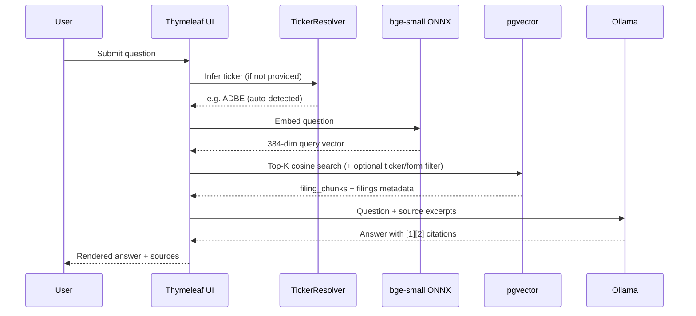

# SEC EDGAR Semantic Search UI

RAG web app for SEC EDGAR filings stored in **pgvector**. Ask a natural-language question, retrieve the top 10 matching chunks, and generate a cited answer with a local **Ollama** LLM.

Companion ingest project: [sec-edgar-filings-to-pgvector](https://github.com/sanjuthomas/sec-edgar-filings-to-pgvector).

## Features

- **Semantic search UI** — Thymeleaf form with question, optional ticker, and optional form-type filters
- **pgvector retrieval** — cosine nearest-neighbor search over the existing `filing_chunks` / `filings` schema (no Spring AI `PgVectorStore` schema; queries the ingest project's tables directly)
- **RAG answers with citations** — Ollama synthesizes an answer from retrieved chunks with inline `[1]`, `[2]`, … citations and source cards linking to SEC EDGAR
- **Auto ticker detection** — when the optional ticker field is blank, the app infers a company filter from the question:
  - **Company names** — e.g. "Adobe" → `ADBE`, "Goldman Sachs" → `GS`
  - **Uppercase ticker symbols** — e.g. `ADBE`, `GS` in the question text
  - Common lowercase words (`it`, `so`, `a`) are **not** treated as tickers
- **Search-in-progress UX** — submit button disables and shows "Searching…" until the page reloads
- **Result metadata** — shows retrieval/generation timing, source count, and applied ticker (with "auto-detected" label when inferred)

## Stack

| Layer | Technology |
|-------|------------|
| UI | Spring Boot 3.4 + Thymeleaf |
| Retrieval | PostgreSQL + pgvector (`filing_chunks`, `filings`) |
| Query embeddings | Spring AI Transformers ONNX (`BAAI/bge-small-en-v1.5`, 384-dim) |
| Answer generation | Spring AI + Ollama (`qwen3:14b` by default, configurable) |

> **Embedding model note:** The pgvector index was built with `BAAI/bge-small-en-v1.5` (384 dimensions). Query embeddings must use the same model. `mxbai-embed-large` (1024-dim) is **not** compatible with the current index. Ollama is used for **chat only**, not query embeddings.

## Prerequisites

- Java 21+
- Maven 3.9+
- PostgreSQL with pgvector on `localhost:5433`, database `edgar` (from sec-edgar-filings-to-pgvector)
- Ollama running locally with your chosen chat model (default: `qwen3:14b`)

## Quick start

```bash
# Ensure Ollama is running
ollama list

# Start the app (first run downloads the ONNX embedding model from Hugging Face)
mvn spring-boot:run
```

Open http://localhost:8095

### Example questions

| Question | Ticker field | Expected behavior |
|----------|--------------|-------------------|
| Do you know if the ADBE board approved a buyback program? | blank | Auto-detects `ADBE` from uppercase symbol |
| Do you know if the Adobe board approved a buyback program? | blank | Auto-detects `ADBE` from company name |
| Who are the elected directors in Goldman Sachs? | blank | Auto-detects `GS` from company name |
| Revenue growth trends | blank | No ticker filter; global top-10 search |

Optional manual filters: ticker (`GS`), form (`10-K`).

## Configuration

Edit `src/main/resources/application.yml`:

```yaml
server:
  port: 8095

spring:
  datasource:
    url: jdbc:postgresql://localhost:5433/edgar
    username: ${PGUSER:sanjuthomas}
    password: ${PGPASSWORD:}

  ai:
    model:
      chat: ollama
      embedding: transformers

    ollama:
      base-url: http://localhost:11434
      chat:
        options:
          model: qwen3:14b
          temperature: 0.2
          num-predict: 2048

    transformers:
      onnx:
        model-uri: https://huggingface.co/onnx-community/bge-small-en-v1.5-ONNX/resolve/main/onnx/model.onnx
      tokenizer:
        uri: https://huggingface.co/onnx-community/bge-small-en-v1.5-ONNX/resolve/main/tokenizer.json

app:
  search:
    top-k: 10
    embedding-dimensions: 384
```

Environment overrides:

```bash
export PGUSER=sanjuthomas
export PGPASSWORD=
mvn spring-boot:run
```

| Property | Description |
|----------|-------------|
| `server.port` | HTTP port (default `8095`) |
| `spring.datasource.*` | PostgreSQL connection to the `edgar` database |
| `spring.ai.ollama.chat.options.model` | Ollama model for answer generation |
| `spring.ai.transformers.onnx.*` | ONNX model for query embeddings (must match ingest model) |
| `app.search.top-k` | Number of chunks retrieved per question |

## How it works



1. User submits a question (optional ticker/form filters).
2. **TickerResolver** applies an explicit ticker if provided; otherwise tries company-name matching, then uppercase ticker symbols in the question.
3. Spring AI embeds the question with `bge-small-en-v1.5` (ONNX).
4. JDBC queries `filing_chunks` joined with `filings`, using cosine distance (`<=>`) and optional `ticker` / `form` filters.
5. Top-K chunks are passed to Ollama with a system prompt requiring inline citations.
6. Thymeleaf renders the answer, source cards, SEC EDGAR links, and applied-ticker metadata.

### Ticker auto-detection

The resolver is a **metadata precision filter**, not vector intelligence. It scopes SQL retrieval to one company when the question mentions a known ticker or company name from the `filings` table.

- **Why it exists:** generic questions like "share buyback program" can match semantically similar chunks from many companies in a global top-10 search.
- **What it does not do:** teach the embedding model that `ADBE` and `Adobe` are synonyms — that similarity is handled by the embedding model at query time; the resolver adds an optional SQL `WHERE ticker = ?` when a company can be identified.
- **Manual override:** filling in the optional ticker field always takes precedence over auto-detection.

## Project layout

```
src/main/java/com/edgar/search/
├── EdgarSemanticSearchApplication.java
├── config/
│   ├── AiConfig.java              # ChatClient bean
│   ├── AppConfig.java
│   ├── PgvectorConfig.java        # PGvector JDBC type registration
│   └── SearchProperties.java
├── controller/
│   └── SearchController.java
├── model/
│   ├── ChunkMatch.java
│   ├── SearchForm.java
│   └── SearchResponse.java
├── repository/
│   ├── FilingChunkRepository.java      # Vector search SQL
│   └── FilingMetadataRepository.java   # Tickers + company names for resolver
└── service/
    ├── RagSearchService.java           # Embed → retrieve → generate
    └── TickerResolver.java             # Auto ticker / company detection

src/main/resources/
├── application.yml
├── templates/index.html
└── static/css/app.css

src/test/java/com/edgar/search/service/
└── TickerResolverTest.java
```

## Tests

```bash
mvn test -Dtest=TickerResolverTest
```

Covers explicit ticker preference, uppercase symbol detection, company-name detection, and rejection of ambiguous common-word matches.

## Troubleshooting

| Problem | Fix |
|---------|-----|
| `relation filing_chunks does not exist` | Run `edgar-etl init-db` in sec-edgar-filings-to-pgvector and ingest filings |
| Connection refused on `5433` | Start pgvector (`docker compose up -d pgvector` in ingest project) |
| Port `8095` already in use | Stop the other process or change `server.port` in `application.yml` |
| Ollama timeout / slow answers | Large models (e.g. `qwen3:30b`) can take minutes; try a smaller model or increase client timeout |
| Poor search quality | Ensure query embeddings use `bge-small-en-v1.5`; re-index if you change embedding models |
| Wrong company in results | Check the "Ticker filter" line in results; override with the optional ticker field |
| `Adobe` vs `ADBE` behave differently | Both should auto-detect `ADBE`; if not, check company name exists in `filings` and restart the app |
| ONNX download fails | Ensure network access to huggingface.co on first startup |
| Java 25 + Mockito test errors | Run a single test class as shown above, or use Java 21 for tests |

## Database requirements

The app expects the schema created by sec-edgar-filings-to-pgvector:

- **`filings`** — one row per accession (`ticker`, `company_name`, `form`, `filing_date`, `document_url`, …)
- **`filing_chunks`** — embedded text chunks with `vector(384)` and HNSW index (`idx_filing_chunks_embedding`)

Useful checks:

```bash
psql postgresql://localhost:5433/edgar -c "SELECT COUNT(*) FROM filing_chunks;"
psql postgresql://localhost:5433/edgar -c "SELECT indexname FROM pg_indexes WHERE tablename = 'filing_chunks';"
```
