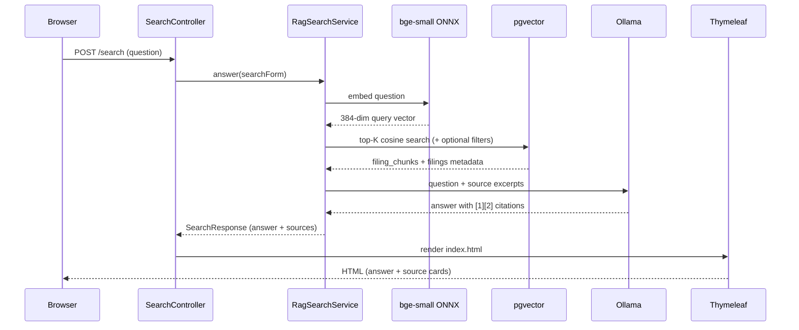

# SEC EDGAR Semantic Search UI

RAG web app for SEC EDGAR filings stored in **pgvector** or **Qdrant**. Ask a natural-language question, retrieve the top 10 matching chunks, and generate a cited answer with a local **Ollama** LLM.

Companion ingest projects: [sec-edgar-filings-to-pgvector](https://github.com/sanjuthomas/sec-edgar-filings-to-pgvector), [sec-edgar-filings-to-qdrant](https://github.com/sanjuthomas/sec-edgar-filings-to-qdrant).

Licensed under the [MIT License](LICENSE).

## Features

- **Semantic search UI** — Thymeleaf form with question, optional ticker, and optional form-type filters
- **pgvector retrieval** — cosine nearest-neighbor search over the existing `filing_chunks` / `filings` schema (no Spring AI `PgVectorStore` schema; queries the ingest project's tables directly)
- **RAG answers with citations** — Ollama synthesizes an answer from retrieved chunks with inline `[1]`, `[2]`, … citations and source cards linking to SEC EDGAR
- **Search-in-progress UX** — submit button disables and shows "Searching…" until the page reloads
- **Result metadata** — shows retrieval/generation timing and source count

## Stack

| Layer | Technology |
|-------|------------|
| UI | Spring Boot 3.4 + Thymeleaf |
| Retrieval | PostgreSQL + pgvector (`filing_chunks`, `filings`) |
| Query embeddings | Spring AI Transformers ONNX (`BAAI/bge-small-en-v1.5`, 384-dim) |
| Answer generation | Spring AI + Ollama (`qwen3:14b` by default, configurable) |

> **Embedding model note:** The pgvector index was built with `BAAI/bge-small-en-v1.5` (384 dimensions). Query embeddings must use the same model. `mxbai-embed-large` (1024-dim) is **not** compatible with the current index. Ollama is used for **chat only**, not query embeddings.

## Prerequisites

- Java 21+
- Maven 3.9+
- PostgreSQL with pgvector on `localhost:5433`, database `edgar` (from sec-edgar-filings-to-pgvector)
- Ollama running locally with your chosen chat model (default: `qwen3:14b`)

## Quick start

```bash
# Ensure Ollama is running
ollama list

# Start the app (first run downloads the ONNX embedding model from Hugging Face)
mvn spring-boot:run
```

Open http://localhost:8095

Example questions:

> Do you know if the Adobe board approved a buyback program?

> Who are the elected directors in Goldman Sachs?

Optional filters: ticker (`GS`), form (`10-K`).

## Docker

Published to Docker Hub as [`sanjuthomas/sec-edgar-filings-semantic-search-ui`](https://hub.docker.com/r/sanjuthomas/sec-edgar-filings-semantic-search-ui).

### Run from Docker Hub

Requires **pgvector** and **Ollama** reachable from the container (example uses services on the Docker host):

```bash
docker run --rm -p 8095:8095 \
  -e SPRING_DATASOURCE_URL=jdbc:postgresql://host.docker.internal:5433/edgar \
  -e SPRING_DATASOURCE_USERNAME=sanjuthomas \
  -e SPRING_AI_OLLAMA_BASE_URL=http://host.docker.internal:11434 \
  --add-host=host.docker.internal:host-gateway \
  sanjuthomas/sec-edgar-filings-semantic-search-ui:latest
```

Or with Compose:

```bash
docker compose up --build
```

### Build locally

```bash
docker build -t sanjuthomas/sec-edgar-filings-semantic-search-ui:local .
```

### Publish to Docker Hub (maintainers)

GitHub Actions publishes on push to `main`, version tags (`v*`), or manual **workflow_dispatch**.

Add these repository secrets in GitHub:

| Secret | Description |
|--------|-------------|
| `DOCKERHUB_USERNAME` | Docker Hub username (`sanjuthomas`) |
| `DOCKERHUB_TOKEN` | Docker Hub access token |

Create a token at https://hub.docker.com/settings/security

Image tags:

| Trigger | Tags |
|---------|------|
| Push to `main` | `latest`, `main-<sha>` |
| Tag `v1.0.0` | `latest`, `v1.0.0` |
| Manual dispatch | `main-<sha>` |

## Configuration

Edit `src/main/resources/application.yml`:

```yaml
server:
  port: 8095

spring:
  datasource:
    url: jdbc:postgresql://localhost:5433/edgar
    username: ${PGUSER:sanjuthomas}
    password: ${PGPASSWORD:}

  ai:
    model:
      chat: ollama
      embedding: transformers

    ollama:
      base-url: http://localhost:11434
      chat:
        options:
          model: qwen3:14b
          temperature: 0.2
          num-predict: 2048

    transformers:
      onnx:
        model-uri: https://huggingface.co/onnx-community/bge-small-en-v1.5-ONNX/resolve/main/onnx/model.onnx
      tokenizer:
        uri: https://huggingface.co/onnx-community/bge-small-en-v1.5-ONNX/resolve/main/tokenizer.json

app:
  search:
    top-k: 10
    embedding-dimensions: 384
```

Environment overrides:

```bash
export PGUSER=sanjuthomas
export PGPASSWORD=
mvn spring-boot:run
```

| Property | Description |
|----------|-------------|
| `server.port` | HTTP port (default `8095`) |
| `spring.datasource.*` | PostgreSQL connection to the `edgar` database |
| `spring.ai.ollama.chat.options.model` | Ollama model for answer generation |
| `spring.ai.transformers.onnx.*` | ONNX model for query embeddings (must match ingest model) |
| `app.search.top-k` | Number of chunks retrieved per question |

## How it works



1. Browser submits a question via POST to `SearchController` (optional ticker/form filters).
2. `RagSearchService` orchestrates the full RAG pipeline on the server — chunks are **not** sent to the browser until the LLM finishes.
3. Spring AI embeds the question with `bge-small-en-v1.5` (ONNX).
4. JDBC queries `filing_chunks` joined with `filings`, using cosine distance (`<=>`) and optional `ticker` / `form` filters.
5. Top-K chunks are formatted in memory and passed to Ollama with a system prompt requiring inline citations.
6. Thymeleaf renders a single HTML response with the answer, source cards, and SEC EDGAR links.

## Tests

```bash
mvn test
```

## Troubleshooting

| Problem | Fix |
|---------|-----|
| `relation filing_chunks does not exist` | Run `edgar-etl init-db` in sec-edgar-filings-to-pgvector and ingest filings |
| Connection refused on `5433` | Start pgvector (`docker compose up -d pgvector` in ingest project) |
| Port `8095` already in use | Stop the other process or change `server.port` in `application.yml` |
| Ollama timeout / slow answers | Large models (e.g. `qwen3:30b`) can take minutes; try a smaller model or increase client timeout |
| Poor search quality | Ensure query embeddings use `bge-small-en-v1.5`; re-index if you change embedding models; try optional ticker/form filters |
| ONNX download fails | Ensure network access to huggingface.co on first startup |
| Java 25 + Mockito test errors | Use Java 21 for tests |

## Database requirements

The app expects the schema created by sec-edgar-filings-to-pgvector:

- **`filings`** — one row per accession (`ticker`, `company_name`, `form`, `filing_date`, `document_url`, …)
- **`filing_chunks`** — embedded text chunks with `vector(384)` and HNSW index (`idx_filing_chunks_embedding`)

Useful checks:

```bash
psql postgresql://localhost:5433/edgar -c "SELECT COUNT(*) FROM filing_chunks;"
psql postgresql://localhost:5433/edgar -c "SELECT indexname FROM pg_indexes WHERE tablename = 'filing_chunks';"
```

## License

This project is licensed under the MIT License. See [LICENSE](LICENSE).
